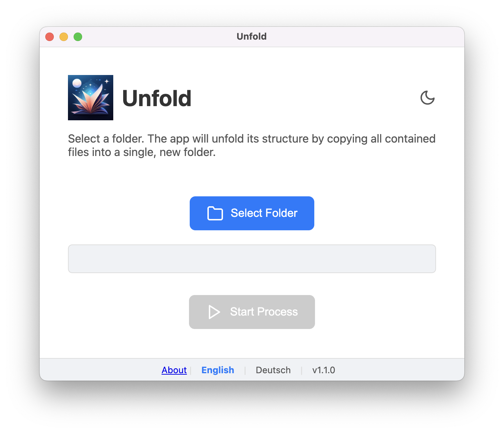
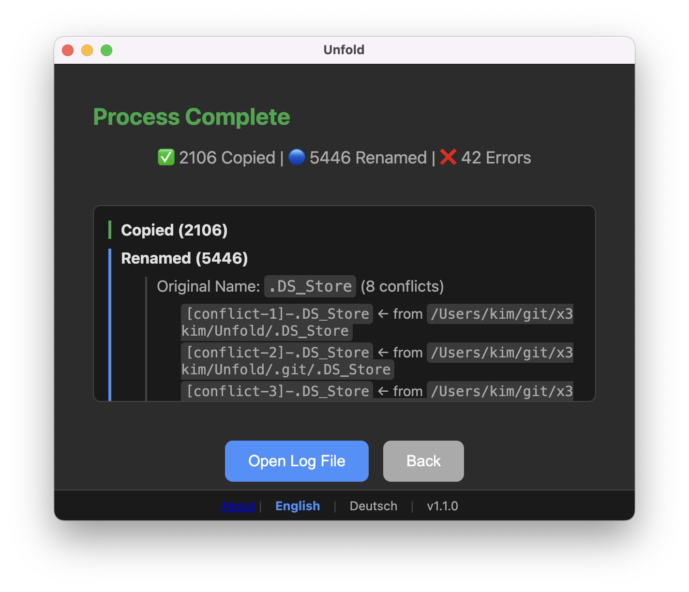
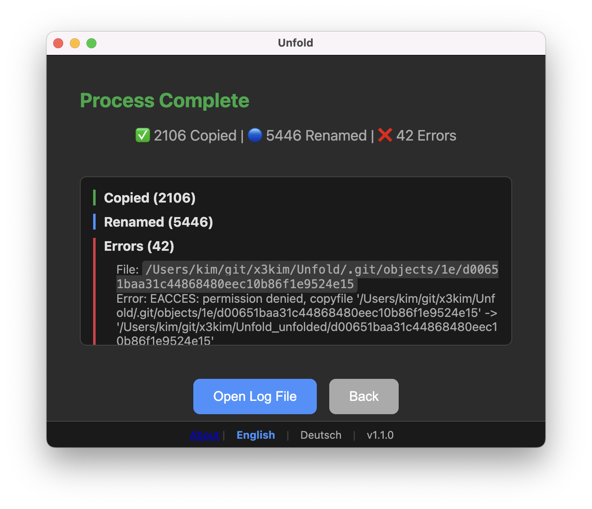
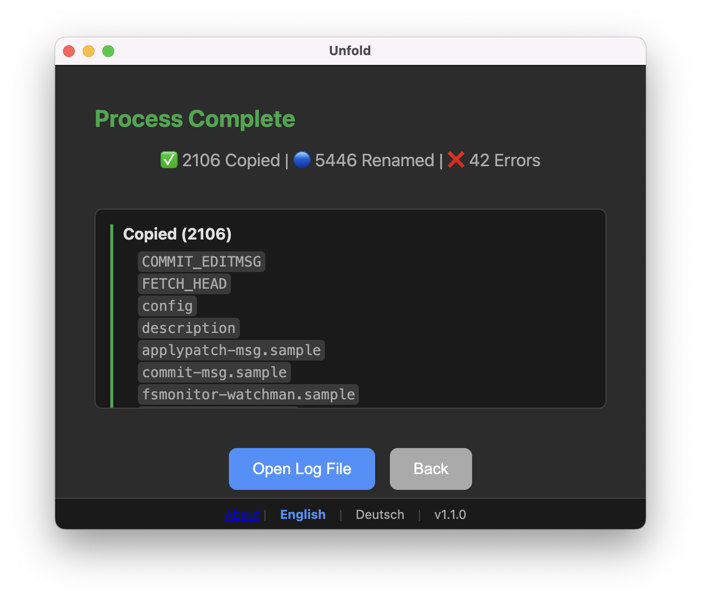

<div align="center">
  
  <h1>Unfold ✨</h1>
  <p>
    A minimalist desktop utility to flatten a nested folder structure into a single directory.
  </p>
  <p>
    <a href="https://github.com/x3kim/unfold/releases"></a>
    
    <a href="https://github.com/x3kim/unfold/blob/main/LICENSE"></a>
  </p>
</div>

<div align="center">
  <br>
  <div>
    
    
    
    
  </div>
  <br>
  <em>(Pictured: Main screen in light mode and the results screen in dark mode)</em>
</div>

---

## 🚀 Key Features

*   📂 **Flexible Unfold Modes**:
    *   **Copy (Default):** Securely copies all files, leaving the originals untouched.
    *   **Move:** First copies all files, then deletes the source folder only upon 100% success.
    *   **Dry Run:** Simulates the entire process and provides a preview of the results without modifying a single file.
*   ⚠️ **Intelligent Conflict Handling**: Automatically renames files with duplicate names (e.g., `[conflict-1]-image.jpg`) so you never lose a file.
*   🗜️ **Optional ZIP Archiving**: Create a ZIP archive of the result folder right after the process with a single click.
*   📝 **Detailed & Interactive Logs**: Get a clean, interactive, and fully translated summary right within the app, including prominent status messages.
*   💾 **Markdown Documentation**: A detailed `documentation.md` file is automatically generated in the output folder for every operation.
*   🎨 **Persistent UI Settings**: The app remembers your chosen **window size**, **position**, and **light/dark theme** between sessions.
*   🌍 **Fully Localized**: The complete user interface is available in English & German, with an easy-to-use language switcher.
*   🛡️ **Robust & Safe**: Built-in protection mechanisms prevent the app from being run on itself or on critical system & project folders.
*   🖥️ **Cross-Platform**: Works on Windows, macOS, and Linux.

## ⚙️ Getting Started

There are two ways to use Unfold: by installing the ready-to-use application or by running it from the source code.

### For Users (Installation)

1.  Go to the **[Releases Page](https://github.com/x3kim/unfold/releases)**.
2.  Download the latest version for your operating system (`.exe` for Windows, `.dmg` for macOS, or `.AppImage` for Linux).
3.  Run the installer or the application file. That's it!

### For Developers (From Source)

If you want to contribute or run the app from the source code, follow these steps.

1.  **Prerequisites**: Make sure you have [Node.js](https://nodejs.org/) installed on your system.

2.  **Clone & Install**:
    ```bash
    # Clone the repository
    git clone https://github.com/x3kim/unfold.git
    
    # Navigate into the project directory
    cd unfold
    
    # Install the necessary dependencies
    npm install
    ```

3.  **Run & Build**:
    ```bash
    # Run the application in development mode
    npm start
    
    # Build the packaged application for distribution
    npm run build
    ```
    The final application will be located in the `dist/` directory.

## 🛠️ Built With

*   [**Electron**](https://www.electronjs.org/) - The framework for building cross-platform desktop apps with web technologies.
*   [**Node.js**](https://nodejs.org/) - For all the file system magic in the backend.
*   **HTML5, CSS3, Vanilla JavaScript** - No heavy frameworks, just pure web tech for a lightweight and fast UI.

## 📄 License

This project is licensed under the MIT License - see the [LICENSE](LICENSE) file for details.

Copyright (c) 2025 x3kim